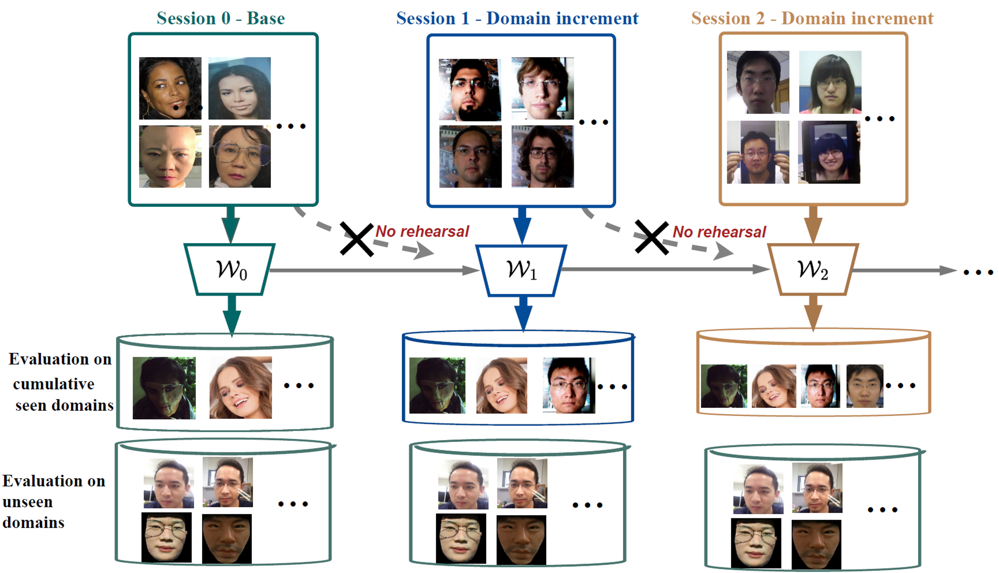
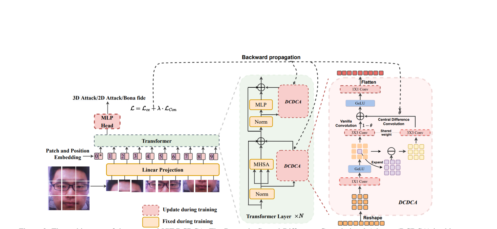
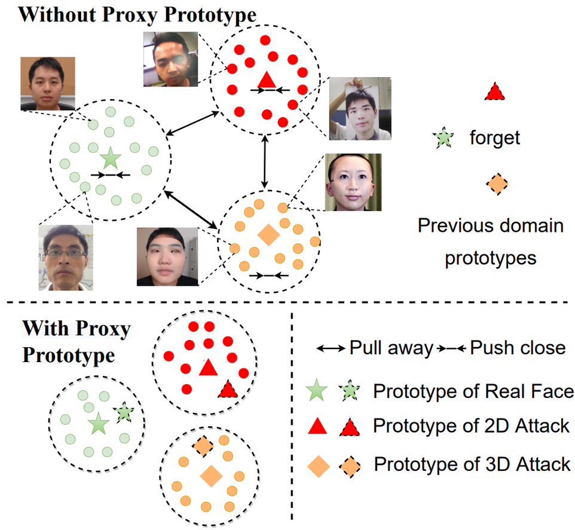
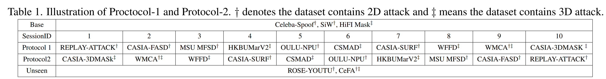

# DCL_FAS_ICCV2023
Rehearsal-Free Domain Continual Face Anti-Spoofing: Generalize More and Forget Less, accepted in ICCV 2023 (Oral)

## About
Previous work of domain continual learning for FAS:
   + Use rehearsal data to reduce forgetting
   + Only evaluate seen data performance (intra-domain)

Our work:
   + Use no rehearsal-data based on privacy concerns
   + Evaluate models on unseen domain performance

## Observation & Motivation
+ Cross/Unseen-domain performance is important but ignored in domain continual learning for Face Anti-Spoofing (DCL-FAS)
+ The more generalized the model, the less forgetting the model 
+ We handle cross-domain and catastrophic forgetting performance at the same time 

## Our contributions
+ We propose Dynamic Central Convolutional Adapter (DCDCA) for strong domain generalized capability

+ We propose Proxy Prototype Contrastive Regularization (PPCR) to reduce forgetting, without  rehearsal data

+ We propose the first rehearsal-free domain continual face anti-spoofing protocols based on 15 datasets, which is practically based on the released years

    + Base: Large-scale pretraining (all train data used)
    + Continual: Low-shot (100 frames used for fine-tuning)
    + Evaluation: both seen& unseen 
    + Dataset ordered according to released years (2012-2022)
        + Protocol 1: old to new
        + Protocol 2: new to old

